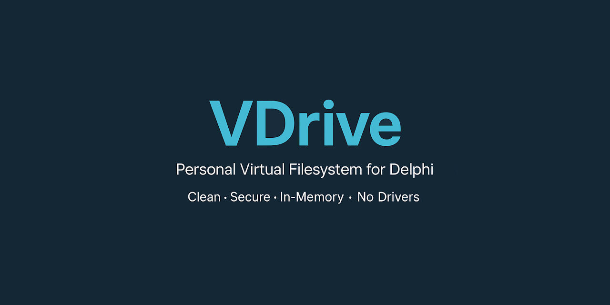

  
[](https://discord.gg/tPWjMwK)
[](https://bsky.app/profile/tinybiggames.com)    

**VDrive** is a lightweight, high-performance Delphi library that empowers your applications with their own private, fully virtualized filesystem — entirely in-memory, with **no drivers**, **no installers**, and **no filesystem footprint**. 🛡️

It exposes a simple and intuitive API:

```pascal
function vdPath(const AFilename: string): string;
```

Given any filename, `vdPath` returns a special **virtual drive path** where you can seamlessly create, read, write, and manage files and folders **as if they existed on the real disk**.  
Files written to this virtual drive persist for the lifetime of your application and are completely invisible to the underlying operating system. 🧩

When your application terminates, the entire virtual filesystem is automatically destroyed, leaving **no traces** behind. 🧹

## 🎯 What You Can Do with VDrive

- 📦 Package and load **DLLs** and **assets** hidden inside your EXE, without ever writing to disk.
- 📄 Create and manage **temporary files**, **cache files**, **logs**, and **configuration data** entirely in memory.
- 🔧 Access your virtual drive using **standard Delphi file I/O APIs** (`TFile`, `TStream`, `AssignFile`, etc.).
- 🔐 **Secure** your runtime resources from tampering, antivirus false positives, and prying eyes.
- 🧹 Eliminate filesystem clutter — no need to extract files or clean up temporary folders.

**Anything you can do with the OS filesystem, you can do inside your app's private virtual drive.** 🚀

## ✨ Key Features

- **Simple API** — One function (`vdPath`) to access your virtual drive.
- **Fully In-Memory** — Files never touch the physical disk.
- **Standard Compatibility** — Works transparently with existing Delphi file handling routines.
- **Secure & Hidden** — Protects your embedded resources and runtime data.
- **Zero External Dependencies** — Pure native Delphi, no third-party libraries.
- **Tiny Footprint** — Minimal overhead, blazing fast performance.
- **Automatic Cleanup** — Virtual filesystem vanishes when your app exits.
- **User-Mode Only** — No drivers, no admin rights, no OS modifications.

## 🔥 Example: Loading a DLL from a `TResourceStream` into VDrive

```pascal
uses
  System.Classes, System.SysUtils, System.IOUtils, Winapi.Windows;

procedure LoadDllFromResource;
var
  LResStream: TResourceStream;
  LPath: string;
begin
  // Generate a virtual path for the DLL
  LPath := vdPath('myhidden.dll');

  // Load the DLL from an embedded resource into the virtual drive
  LResStream := TResourceStream.Create(HInstance, 'MYDLL', RT_RCDATA);
  try
    LResStream.SaveToFile(LPath);
  finally
    LResStream.Free;
  end;

  // Load the DLL at runtime, directly from the virtual drive
  if LoadLibrary(PChar(LPath)) = 0 then
    RaiseLastOSError;
end;
```

> 💡 In this example, the DLL is embedded inside your application as a resource (`MYDLL`), saved virtually to VDrive, and loaded without ever touching disk storage.

## 🛠️ Why Use VDrive?

| 🧩 Challenge | 🚀 VDrive Solution |
|:---|:---|
| Need to extract temporary files securely | Store them in your private virtual drive |
| Want to ship runtime DLLs/assets without exposing them | Embed and load them invisibly in memory |
| Tired of cleaning up temp folders | Let VDrive auto-clean when your app closes |
| Risk of antivirus false positives from temp file writes | Eliminate disk I/O entirely |
| Need easy integration into existing code | Works seamlessly with standard file operations |

## 💼 Typical Use Cases

- 📦 Embedding and loading **DLLs** or **plugins** without filesystem exposure
- 🚀 Building **self-contained apps** with in-memory assets
- 🔒 Securely managing **temporary data** and **runtime configuration**
- 🧳 Building **portable applications** that leave no traces behind
- ⚡ Improving **startup performance** by avoiding disk I/O


> 🚧️ **This repository is currently under construction.**
>  
> VDrive is actively being developed. Features, APIs, and internal structure are subject to change.  
>  
> Contributions, feedback, and issue reports are welcome as the project evolves.


## 🛠️ Support and Resources

- 🐞 **Report issues** via the [Issue Tracker](https://github.com/tinyBigGAMES/VDrive/issues).
- 💬 **Engage in discussions** on the [Forum](https://github.com/tinyBigGAMES/VDrive/discussions) and [Discord](https://discord.gg/tPWjMwK).
- 📚 **Learn more** at [Learn Delphi](https://learndelphi.org).

## 🤝 Contributing  

Contributions to **✨ VDrive** are highly encouraged! 🌟  
- 🐛 **Report Issues:** Submit issues if you encounter bugs or need help.  
- 💡 **Suggest Features:** Share your ideas to make **VDrive** even better.  
- 🔧 **Create Pull Requests:** Help expand the capabilities and robustness of the library.  

Your contributions make a difference! 🙌✨

#### Contributors 👥🤝
<br/>

<a href="https://github.com/tinyBigGAMES/VDrive/graphs/contributors">
  
</a>

## 📜 Licensing

**VDrive** is distributed under the **🆓 BSD-3-Clause License**, allowing for redistribution and use in both source and binary forms, with or without modification, under specific conditions.  
See the [📜 LICENSE](https://github.com/tinyBigGAMES/VDrive?tab=BSD-3-Clause-1-ov-file#BSD-3-Clause-1-ov-file) file for more details.

---

🚀 Take full control of your Delphi app’s resources with **VDrive** —  
**Clean. Secure. Invisible. Fast.**

<p align="center">

</p>
<h5 align="center">
  
Made with ❤️ in Delphi  
